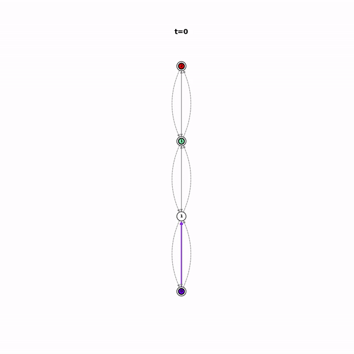

# cops: Intermittent connectivity in communication-constrained multi-agent networks

<p align="center">
  
</p>

**cops** is a compact python package built on [networkx](https://networkx.org/) for designing data passing on graphs by allowing agents to act as data mules, transporting data in a intermittent connected configuration. It utilizes [Gurobi Optimizer](https://www.gurobi.com/) and/or [Mosek](https://www.mosek.com/) for efficient optimization to generate plans that fulfill intermittent connectivity contraints. **cops** implements algorithms and optimization problems from [Intermittent Connectivity for Exploration in Communication-Constrained Multi-Agent Systems](https://arxiv.org/abs/1911.08626).

---

# Table of Contents
1. [Installation](#installation)
2. [Docs](#docs)
    1. [Graph](#cops.graph.***Graph***)
    2. [ConnectivityProblem](#cops.problem.***ConnectivityProblem***)
    3. [ClusterProblem](#cops.clustering.***ClusterProblem***)
    3. [ExplorationProblem](#cops.explore_problem.***ExplorationProblem***)
    3. [Animate](#cops.***animate***)
3. [Examples](#examples)
    1. [Example 1: Maximize Reward](#example-1-maximize-reward)
    2. [Example 2: Graph Exploration](#example-2-graph-exploration)
4. [Contributing](#contributing)
5. [Updates](#updates)
6. [Credits](#credits)
---


# Installation

1. Install dependencies
```bash
sudo apt install graphviz ffmpeg    #debian
brew install graphviz ffmpeg        #macOS
```

2. Install [Gurobi Optimizer](https://www.gurobi.com/) and/or [Mosek](https://www.mosek.com/)

3. Install cops
```bash
git clone https://github.com/FilipKlaesson/cops.git && cd cops
pip install .
```

4. Test installation (Optional)
```bash
pytest
```

---

# Docs

The terminology and methods used in this documentation are defined and described in detailed in the paper [Intermittent Connectivity for Exploration in Communication-Constrained Multi-Agent Systems](https://arxiv.org/abs/1911.08626) [1]. The main feature of ***cops*** is to solve the Intermittent Connectivity Problem (Problem 1) and the Information-Consistent Intermittent Connectivit Problem (Problem 2) in [1] in different problem settings such as in an exploration loop of an initially unknown graph and for scalability using clusters.

### cops.graph.***Graph***:

The ***Graph*** object extends the nx.MultiDiGraph object to a communication-mobility network.

##### Methods

<pre>
<b>__init__</b>()

Constructor.
</pre>

<pre>
<b>add_transition_path</b>(transition_edges, w=None)

    <b>transition_edges</b>: list(object)
        List of nodes in the transition path. 
        Consecutive nodes are connected in the graph with a 2-way transition edge.
    <b>w</b>: float
        Edge weight.

Add a transition path to the graph. 
</pre>

<pre>
<b>add_connectivity_path</b>(connectivity_edges, w=None)

    <b>connectivity_edges</b>: list(object)
        List of nodes in the connectivity path. 
        Consecutive nodes are connected in the graph with a 2-way connectivity edge.
    <b>w</b>: float
        Edge weight.

Add a connectivity path to the graph. 
</pre>

<pre>
<b>set_frontiers</b>(frontiers)

    <b>frontiers</b>: dict
        Dict mapping frontier node id to frontier node reward.

Set frontiers with frontier reward in graph.
</pre>

<pre>
<b>init_agents</b>(agent_dictionary)

    <b>agent_dictionary</b>: dict
        Dict mapping agent id to node position.

Init agents in graph.
</pre>

<pre>
<b>set_small_node</b>(small_nodes)

    <b>small_nodes</b>: list(object)
        List of small node id's.

Set node property small to a list of nodes in graph.
</pre>

<pre>
<b>is_frontier</b>(v)

    <b>v</b>: object
        Node id.

    returns: <b>bool</b>

Check if node is a frontier in the graph.
</pre>

<pre>
<b>is_known</b>()

    returns: <b>bool</b>

Check if graph is fully explored.
</pre>

<pre>
<b>set_node_positions</b>(position_dictionary)

    <b>position_dictionary</b>: dict
        Dict mapping node id's to node position in the xy plane.

Set node positions in the xy plane.
</pre>

<pre>
<b>plot_graph</b>(filename=None)

    <b>filename</b>: str
        Output filename.

Generates static plot of the mobility-communication network.
</pre>

### cops.problem.***ConnectivityProblem***:

The ***ConnectivityProblem*** object is the base class for solving Problem 1 and 2 in [1].

##### Methods

<pre>
<b>__init__</b>(graph=None, src=None, snk=None, always_src=False, reward_demand=0.4, 
         extra_constr=None, static_agents=None, big_agents=None, 
         final_position=None, master=None, eagents=None, frontier_reward=100, 
         frontier_reward_decay=0.4, reward_dict=None)

    <b>graph</b>: Graph (default: None)
        Mobility-Communication network with initial conditions.
    <b>src</b>: set(object) (default: None)
        Set of source agents.
    <b>snk</b>: set(object) (default: None)
        Set of sink agents.
    <b>always_src</b>: list(object) (default: False)
        If true, always use source->sink type constraint.
    <b>reward_demand</b>: list(object) (default: 0.4)
        Fraction of total reward demanded.
    <b>extra_constr</b>: list(object) (default: None)
        Additional constraints.
    <b>static_agents</b>: set(object) (default: None)
        Set of agents that don't move.
    <b>big_agents</b>: set(object) (default: None)
        Set of agents that can't pass each other
    <b>final_position</b>: dict(object: object) (default: None)
        Dict of constraints mapping agents to their final states.
    <b>master</b> list(object) (default: None)
        List of master agents.
    <b>eagents</b> set(object) (default: None)
        Set of agents that can explore frontiers.
    <b>frontier_reward</b>: float (default: 100)
        Reward to end at a frontier node.
    <b>frontier_reward_decay</b> float (default: 0.4)
        Decay factor for additional agents at frontier node.
    <b>reward_dict</b> list(object) (default: None)
        User-defined frontier rewards in addition to frontier_reward.

Constructor.
</pre>

<pre>
<b>solve_powerset</b>(**kwargs=None)

    <b>kwargs</b>: dict
        Additional arguments to feed the solver. 

Solve the ConnectivityProblem using the powerset method. 
<span style="color:red">NOT RECOMMENDED</span>
</pre>

<pre>
<b>solve_adaptive</b>(**kwargs=None)

    <b>kwargs</b>: dict
        Additional arguments to feed the solver. 

Solve the ConnectivityProblem using the adaptive powerset method. 
<span style="color:red">NOT RECOMMENDED</span>
</pre>

<pre>
<b>solve_flow</b>(**kwargs=None)

    <b>kwargs</b>: dict
        Additional arguments to feed the solver. 

    returns: <b>Solver output object (from cops.problem.***_solve***)</b>

Solve the ConnectivityProblem using the flow method. 
<span style="color:green">RECOMMENDED</span>
</pre>

<pre>
<b>diameter_solve_flow</b>(**kwargs=None)

    <b>kwargs</b>: dict
        Additional arguments to feed the solver. 

    returns: <b>Solver output object (from cops.problem.***_solve***)</b>

Solve the ConnectivityProblem using the flow method.
Using the diameter of the graph as initial time horizon and search for 
feasible solution incrementally.
<span style="color:green">RECOMMENDED</span>
</pre>

<pre>
<b>linear_search_solve_flow</b>(**kwargs=None)

    <b>kwargs</b>: dict
        Additional arguments to feed the solver. 

    returns: <b>Solver output object (from cops.problem.***_solve***)</b>

Solve the ConnectivityProblem using the flow method. 
Searching for feasible solution incrementally from T = 1.
<span style="color:orange">NOT RECOMMENDED</span>
</pre>

##### Attributes

<pre>
<b>graph</b> Graph (required)
Mobility-Communication network with initial conditions.
</pre>

<pre>
<b>T</b> int (default: None)
Time horizon for the optimization problem.
</pre>

<pre>
<b>src</b> set(object) (default: None)
Set of source agents.
</pre>

<pre>
<b>snk</b> set(object) (default: None)
Set of sink agents.
</pre>

<pre>
<b>always_src</b> list(object) (default: False)
If true, always use source->sink type constraint.
</pre>

<pre>
<b>reward_demand</b> list(object) (default: 0.4)
Fraction of total reward demanded.
</pre>

<pre>
<b>max_reward_demand_iter</b> int (default: 5)
Max number of iterations to find a better solutions.
</pre>

<pre>
<b>extra_constr</b> list(object) (default: None)
Additional constraints.
</pre>

<pre>
<b>static_agents</b> set(object) (default: None)
Set of agents that don't move.
</pre>

<pre>
<b>big_agents</b> set(object) (default: None)
Set of agents that can't pass each other
</pre>

<pre>
<b>final_position</b> dict(object: object) (default: None)
Dict of constraints mapping agents to their final states.
</pre>

<pre>
<b>master</b> list(object) (default: None)
List of master agents.
</pre>

<pre>
<b>eagents</b> set(object) (default: None)
Set of agents that can explore frontiers.
</pre>

<pre>
<b>frontier_reward</b> float (default: 100)
Reward to end at a frontier node.
</pre>

<pre>
<b>frontier_reward_decay</b> float (default: 0.4)
Decay factor for additional agents at frontier node.
</pre>

<pre>
<b>reward_dict</b> list(object) (default: None)
User-defined frontier rewards in addition to frontier_reward.
</pre>

<pre>
<b>traj</b> dict (default: None)
Trajectory part of solution. Dict mapping (agent, time) tuple to node id.
</pre>

<pre>
<b>conn</b> dict (default: None)
Communication part of solution acting over connectivity edges. Dict mapping time to (node_from, node_to, message_indicator/base-id) tuples.
</pre>

<pre>
<b>tran</b> dict (default: None)
Communication part of solution acting over transition edges. Dict mapping time to (node_from, node_to, message_indicator/base-id) tuples.
</pre>

### cops.clustering.***ClusterProblem***:

The ***ClusterProblem*** class utilize the ***ConnectivityProblem*** with a clustering technique for improved scalability as described in [1].
It exposes two methods ***solve_to_frontier_problem*** and ***solve_to_base_problem*** to allow for exploration of initially unknown graphs.

##### Methods

<pre>
<b>__init__</b>(graph=None, static_agents=None, big_agents=None, 
         final_position=None, master=None, eagents=None, frontier_reward=100, 
         frontier_reward_decay=0.4, reward_dict=None)

    <b>graph</b>: Graph (default: None)
        Mobility-Communication network with initial conditions.
    <b>static_agents</b>: set(object) (default: None)
        Set of agents that don't move.
    <b>big_agents</b>: set(object) (default: None)
        Set of agents that can't pass each other
    <b>final_position</b>: dict(object: object) (default: None)
        Dict of constraints mapping agents to their final states.
    <b>master</b> list(object) (default: None)
        List of master agents.
    <b>eagents</b> set(object) (default: None)
        Set of agents that can explore frontiers.
    <b>frontier_reward</b>: float (default: 100)
        Reward to end at a frontier node.
    <b>frontier_reward_decay</b> float (default: 0.4)
        Decay factor for additional agents at frontier node.
    <b>reward_dict</b> list(object) (default: None)
        User-defined frontier rewards in addition to frontier_reward.

Constructor.
</pre>

<pre>
<b>solve_to_frontier_problem</b>(verbose=False, soft=False, dead=False)

    <b>verbose</b>: bool (default: False)
        Print solver output.
    <b>soft</b>: bool (default: False)
        Wheter to use hard or soft contraints for subclusters.
    <b>dead</b>: bool (default: False)
        Wheter to plan in dead clusters.

    returns: <b>cops.clustering.***ToFrontierData***</b>

Solve the pre-exploration in [1] using clusters. 
</pre>


<pre>
<b>solve_to_base_problem</b>(tofront_data, verbose=False, dead=True)

    <b>tofront_data</b>: ToFrontierData object
        Output of previous solve_to_frontier_problem problem.
    <b>verbose</b>: bool (default: False)
        Print solver output.
    <b>dead</b>: bool (default: True)
        Wheter to plan in dead clusters, enables evacuation.

Solve the pre-exploration in [1] using clusters. 
</pre>


##### Attributes

<pre>
<b>num_clusters</b> int (default: None)
Desired number of clusters.
</pre>

<pre>
<b>max_problem_size</b> int (default: 4000)
Maximum problem size.
</pre>

<pre>
<b>max_centrality_reward</b> int (default: 20)
Maximum centrality reward.
</pre>

<pre>
<b>evac_reward</b> int (default: 100)
Evacuation reward.
</pre>

<pre>
<b>graph</b> Graph (required)
Mobility-Communication network with initial conditions.
</pre>

<pre>
<b>static_agents</b> set(object) (default: None)
Set of agents that don't move.
</pre>

<pre>
<b>big_agents</b> set(object) (default: None)
Set of agents that can't pass each other
</pre>

<pre>
<b>final_position</b> dict(object: object) (default: None)
Dict of constraints mapping agents to their final states.
</pre>

<pre>
<b>master</b> list(object) (default: None)
List of master agents.
</pre>

<pre>
<b>eagents</b> set(object) (default: None)
Set of agents that can explore frontiers.
</pre>

<pre>
<b>frontier_reward</b> float (default: 100)
Reward to end at a frontier node.
</pre>

<pre>
<b>frontier_reward_decay</b> float (default: 0.4)
Decay factor for additional agents at frontier node.
</pre>

<pre>
<b>reward_dict</b> list(object) (default: None)
User-defined frontier rewards in addition to frontier_reward.
</pre>


### cops.explore_problem.***ExplorationProblem***:

The ***ExplorationProblem*** class implements the exploration algorithm developed in [1].

##### Methods

<pre>
<b>__init__</b>()

Constructor.
</pre>

<pre>
<b>solve</b>()

Solve the exploration progblem described in [1]. 
</pre>


##### Attributes

<pre>
<b>graph</b> Graph (required)
Mobility-Communication network with initial conditions.
</pre>

<pre>
<b>static_agents</b> set(object) (default: None)
Set of agents that don't move.
</pre>

<pre>
<b>eagents</b> set(object) (default: None)
Set of agents that can explore frontiers.
</pre>


### cops.***animate***:

The ***animate*** module provice multiple functions to vizualize problem solutions and plan execution.

##### Methods

<pre>
<b>animate.animate</b>(graph, traj, conn, node_colors=None, 
    node_explored=None, node_dead=None, 
    titles=None, unknown_color="white",
    dead_color="white", STEP_T=1, FPS=20, size=10, 
    filename="animation.mp4", save_static_figures=False)

    <b>graph</b>: Graph (required)
        Mobility-Communication network with initial conditions.
    <b>traj</b>: dict (required)
        Trajectory part of solution. Dict mapping (agent, time) tuple to node id.
    <b>conn</b>: dict (required)
        Communication part of solution acting over connectivity edges. Dict mapping time to (node_from, node_to, message_indicator/base-id) tuples.
    <b>node_colors</b>: dict (default: None)
        Node colors in animation. Dict mapping (time, node) tuple to color.
    <b>node_explored</b>: dict (default: None)
        Node explored indicator. Dict mapping (time, node) tuple to bool.
    <b>node_dead</b>: dict (default: None)
        Node dead indicator. Dict mapping (time, node) tuple to bool.
    <b>titles</b>: dict (default: None)
        Title in animation at every time step. Dict mapping time to title string.
    <b>unknown_color</b>: string (default: white)
        Color used for indicating unknown nodes.
    <b>dead_color</b>: string (default: white)
        Color used for indicating dead nodes.
    <b>STEP_T</b>: int (default: 1)
        Step time in animation.
    <b>FPS</b>: int (default: 20)
        Frames per second in animation.
    <b>size</b>: inte (default: 10)
        Size of animation.
    <b>filename</b>: str (default: animation.mp4)
        Filename of output animation.
    <b>save_static_figures</b>: bool (default: False)
        Save static figures.

Generate problem solution animation.
</pre>

<pre>
<b>animate.animate_sequence</b>(graph, problem_list, **kwargs)

    <b>graph</b>: Graph (required)
        Mobility-Communication network with initial conditions.
    <b>problem_list</b>: list(ConnectivityProblem) (required)
        List of ConnectivityProblem to animate in a sequence.
    <b>**kwargs</b>: dict (default: None)
        Arguments passed to animate.

Generate animation of sequence of ConnectivityProblem solutions.
</pre>

<pre>
<b>animate.animate_cluster</b>(graph, traj, conn, 
    subgraphs, **kwargs)

    <b>graph</b>: Graph (required)
        Mobility-Communication network with initial conditions.
    <b>traj</b>: dict (required)
        Trajectory part of solution. Dict mapping (agent, time) tuple to node id.
    <b>conn</b>: dict (required)
        Communication part of solution acting over connectivity edges. Dict mapping time to (node_from, node_to, message_indicator/base-id) tuples.
    <b>subgraphs</b>: dict (required)
        Dict mapping cluster id to list of node id's in cluster.
    <b>**kwargs</b>: dict (default: None)
        Arguments passed to animate.***animate***.

Generate problem solution animation with clusters.
</pre>

<pre>
<b>animate.animate_cluster_sequence</b>(graph, problem_list, **kwargs)

    <b>graph</b>: Graph (required)
        Mobility-Communication network with initial conditions.
    <b>problem_list</b>: list (required)
        List of ClusterProblem to animate in a sequence.
    <b>**kwargs</b>: dict (default: None)
        Arguments passed to animate.

Generate animation of sequence of ClusterProblem solutions with clusters.
</pre>

<pre>
<b>animate.animate_cluster_buildup</b>(graph, problem, 
    STEP_T=2, FPS=20, size=10, filename="clustering_animation.mp4")

    <b>graph</b>: Graph (required)
        Mobility-Communication network with initial conditions.
    <b>problem</b>: ClusterProblem (required)
        ClusterProblem to animate cluster buildup for.
    <b>STEP_T</b>: int (default: 2)
        Step time in animation.
    <b>FPS</b>: int (default: 20)
        Frames per second in animation.
    <b>size</b>: inte (default: 10)
        Size of animation.
    <b>filename</b>: str (default: clustering_animation.mp4)
        Filename of output animation.

Generate animation of cluster buildup.
</pre>


# Examples

## Example 1: Maximize Reward

In this example, the cops.problem.***ConnectivityProblem*** class is used to solve Problem 2 in [1] on a the cops.graph.***Graph***. 
For simplicity, a linear graph of length 4 will be used. Agent 0 is the master agent and initially in state 0, and agent 1 and 2 are initially in state 2 and 3 respectivelly. Setting the final state reward in state 0, 1, 2 to 1 and in state 3 to 0 should therefore promote a transition of agent 2 to a final state to gain some reward. In addition we enforce intermittent connectivity contraints that data from agent 1 should be transported to anget 1 during the execution. 

Example code:

```python
from cops.graph import Graph
from cops.problem import ConnectivityProblem
from cops.animate import animate

# Define graph
n = 4
G = Graph()
G.add_transition_path(list(range(n)))
G.add_connectivity_path(list(range(n)))
G.set_node_positions({i: (0, i) for i in range(n)})

# Define frontiers in the graph
frontiers = {i: 1 for i in range(3)}
G.set_frontiers(frontiers)

# Define agents and their initial position
agent_positions = {0: 0, 1: 2, 2: 3}
G.init_agents(agent_positions)

# Set up the connectivity problem
cp = ConnectivityProblem()
cp.graph = G
cp.T = 6
cp.static_agents = []
cp.master = 0
cp.src = [2]
cp.snk = [1]

# Solve optimization problem using the flow method
cp.solve_flow(master=True, frontier_reward=True, 
              connectivity=True, cut=True)

# Animate solution
animate(G, cp.traj, cp.conn)
```

Output:

<p align="center">
  
</p>

## Example 2: Graph Exploration

In this example, the cops.problem.***ClusteringProblem*** class is used to explore a initially unknown graph. 
10 agents will be used, where agent 0 is the only master. All agents are initially in state 0 which is the only known state from the start. 
This problem is similar to the DARPA Subterranean Challange focused on in [1]. Just as described in [1], this problem can be solved by running
***ClusterProblem.solve_to_frontier_problem***, ***ExplorationProblem.solve*** and ***ClusterProblem.solve_to_base_problem*** in a loop
until the graph is fully explored.

Example code:

```python
from colorama import Fore, Style

from cops.clustering import ClusterProblem
from cops.explore_problem import ExplorationProblem
from copy import deepcopy
from cops.animate import animate_cluster_sequence

from graph_examples import get_huge_graph

G = get_huge_graph()

# Set initial position of agents
agent_positions = {r: 0 for r in range(10)}  # agent:position
G.init_agents(agent_positions)
# exploration agents
eagents = [r for r in range(10)]

# Set known attribute
for v in G.nodes():
    G.nodes[v]["known"] = False
for r, v in agent_positions.items():
    G.nodes[v]["known"] = True

problem_list = []

master = 0
master_node = agent_positions[master]
static_agents = [0]
MAXITER = 10000
i_iter = 0

agents_home = True
# MAIN-LOOP----------------------------------------------------------------------
while not G.is_known() or not agents_home:

    frontiers = {v: 2 for v in G.nodes if G.is_frontier(v)}
    G.set_frontiers(frontiers)

    # create sub-graph
    g1 = deepcopy(G)
    g2 = deepcopy(G)
    unknown = [v for v in G.nodes if not G.nodes[v]["known"]]
    g1.remove_nodes_from(unknown)
    g2.remove_nodes_from(unknown)

    # Process1-TRAVERSE TO FRONTIERS-----------------------------------------
    # CLUSTERING
    print()
    print(
        Style.BRIGHT
        + Fore.BLUE
        + "Solving to frontier problem on {} known nodes".format(len(g1))
        + Style.RESET_ALL
    )
    cp1 = ClusterProblem()
    cp1.graph = g1
    cp1.master = master
    cp1.static_agents = [r for r in static_agents]
    # cp1.big_agents = eagents
    cp1.eagents = eagents
    cp1.graph.init_agents(agent_positions)
    tofront_data = cp1.solve_to_frontier_problem(verbose=True, soft=True, dead=True)
    agent_positions = {r: cp1.traj[(r, cp1.T_sol)] for r in cp1.graph.agents}

    problem_list.append(cp1)

    # Process2-EXPLORE FRONTIERS---------------------------------------------
    ep = ExplorationProblem()
    ep.graph = G  # full graph
    ep.T = 8  # exploration time

    ep.static_agents = [r for r in static_agents]  # static agents
    nonactivated_agents = set(agent_positions.keys()) - set(
        r for r_list in tofront_data.active_agents.values() for r in r_list
    )
    for r in nonactivated_agents:
        ep.static_agents.append(r)

    ep.graph.agents = agent_positions
    ep.eagents = eagents
    ep.solve()
    problem_list.append(ep)

    # Process3-SEND DATA TO BASE---------------------------------------------
    # CLUSTERING
    print()
    print(Style.BRIGHT + Fore.BLUE + "Solving to base problem" + Style.RESET_ALL)
    cp2 = ClusterProblem()
    cp2.graph = g2
    cp2.master = master
    cp2.static_agents = [r for r in static_agents]
    # cp2.big_agents = eagents
    cp2.eagents = eagents
    cp2.graph.init_agents(agent_positions)
    cp2.to_frontier_problem = cp1
    cp2.solve_to_base_problem(tofront_data, verbose=True, dead=True)
    agent_positions = {r: cp2.traj[(r, cp2.T_sol)] for r in cp2.graph.agents}

    problem_list.append(cp2)

    # check if all agents are home-------------------------------------------
    agents_home = True
    for r, v in agent_positions.items():
        if v != master_node:
            agents_home = False

    i_iter += 1
    if i_iter > MAXITER:
        break

# ANIMATION----------------------------------------------------------------------

print("Whole loop is completed!")

animate_cluster_sequence(G, problem_list, FPS=15, STEP_T=0.5, save_static_figures = True)
```

Output:

<p align="center">
  
</p>

# Contributing

When contributing to this repository, please first discuss the change you wish to make via issue or email with the owners of this repository. If you decide to fix an issue, it's advisable to check the comment thread to see if there's somebody already working on a fix. If no one is working on it, kindly leave a comment stating that you intend to work on it. That way other people don't accidentally duplicate your effort. Before sending a merge request, make sure to update the **README** with details of changes to the interface under **Updates**. If you're a first time contributor to **cops**, add yourself to the **Credits** list.

# Updates

* v.1.0.0: initial launch: **cops** offers optimization based data transmission plans fulfilling intermittent connectivity contraints. 

# Credits

The following people have contributed to **cops**:

* [Filip Klaesson](https://github.com/FilipKlaesson)
* [Petter Nilsson](https://github.com/pettni)
